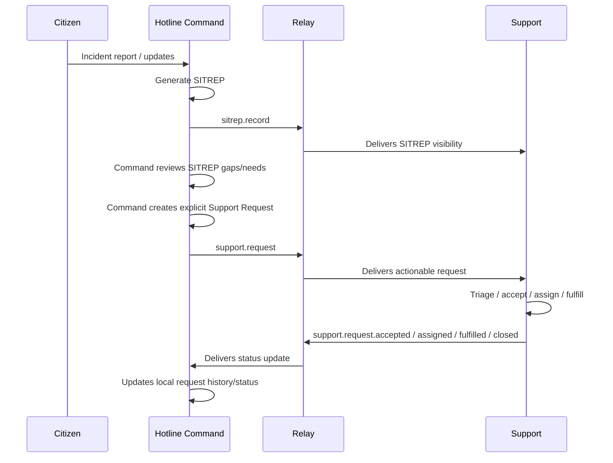

# Support Request Relay Contract Proposal

This proposal defines the boundary between Hotline, Relay, and Support for explicit assistance requests derived from Hotline operational context.

The central rule is:

> SITREP informs. Support Request tasks.

A SITREP is a situational record. It may show needs, constraints, confidence gaps, access issues, and local work already in progress. It must not automatically become a deployment order for Support. A Support Request is a separate, explicit, command-approved request for outside assistance.

## Problem

Support Strategy work can overreach if it infers deployment actions directly from SITREP needs and gaps. A SITREP may describe:

- local resources already requested or being deployed;
- roads or access issues that only need awareness;
- population data that needs verification;
- constraints that require leadership attention but not outside deployment;
- operational needs that may already be handled by barangay command.

If Support treats every SITREP need or gap as actionable, higher hubs may duplicate local work, send resources without barangay approval, or create conflicting assignments.

The safer model is a two-step workflow:

1. Hotline sends SITREPs upward for visibility.
2. Hotline Command explicitly sends Support Requests upward when outside assistance is needed.

## Goals

- Keep SITREP relay and Support Request relay as separate message streams.
- Let Hotline Command create explicit requests from SITREP gaps, needs, incidents, or evidence rows.
- Let Support act only on explicit requests, while using linked SITREPs as context.
- Let Relay remain transport-owned and mostly automatic after handler/message contracts are configured.
- Preserve traceability from request back to source SITREP, gap, evidence row, incident, and requester.
- Support idempotent message delivery and lifecycle updates.
- Avoid hard-coding Support-specific workflow into the SITREP Viewer SDK.

## Non-Goals

- Do not make Support infer deployment orders from passive SITREPs.
- Do not embed Support Request submission logic inside the generic SITREP Viewer SDK.
- Do not duplicate the full SITREP payload inside every Support Request message.
- Do not make Relay own request validation, operational policy, or deployment lifecycle.
- Do not require Relay changes unless routing/auth/message handling cannot support the needed message types.

## Ownership Boundaries

### Hotline Owns

- Request creation from Command surface.
- Choosing which SITREP gaps, needs, evidence rows, or incidents are requestable.
- Request approval and requester identity.
- Local request persistence and lifecycle history.
- Outbound Relay submission for `support.request`.
- Inbound Relay endpoint for `support.request.*` updates.
- Idempotent handling of upstream update messages.
- Command UI status, history, and retry/visibility states.
- Mapping request context back to SITREP and incident records.

### Support Owns

- Intake of `support.request` messages.
- Request triage, acceptance, rejection, prioritization, and assignment.
- Support-side deployment workflow and resource matching.
- Support-side request status/history.
- Sending lifecycle update messages back to Hotline through Relay.
- Support operator/admin UI for request management.
- Any Support Strategy recommendations that are advisory and not automatically deployed.

### Relay Owns

- Message acceptance, routing, delivery, retry, and dead-letter behavior.
- Handler registration and message type pattern matching.
- Source/target system routing.
- Transport authentication between trusted apps.
- Delivery attempt logging and replay behavior.

Relay should not decide whether a request is valid operationally, whether Support should accept it, or what resources should be deployed.

### Shared Hotline/Support Contract

Hotline and Support must agree on:

- message types;
- payload schema;
- correlation IDs;
- lifecycle states;
- status transition rules;
- required/optional fields;
- idempotency rules;
- error/rejection semantics;
- display labels for request states;
- minimum version and compatibility behavior.

## Conceptual Flow



## Message Types

### Outbound From Hotline

Use a distinct message type for new requests:

```text
support.request
```

Future request amendments can use:

```text
support.request.cancelled
support.request.updated
```

Those should be added only when the lifecycle requires them.

### Inbound From Support

Support should send lifecycle updates through message types matching:

```text
support.request.*
```

Recommended first-pass update types:

```text
support.request.received
support.request.accepted
support.request.rejected
support.request.assigned
support.request.en_route
support.request.fulfilled
support.request.closed
```

`received` may be optional if Relay delivery acceptance already provides enough signal. `accepted` and `rejected` should be explicit Support decisions.

## Relay Envelope

The Relay envelope should follow the existing canonical target pattern used by SITREP relay:

```json
{
  "message_type": "support.request",
  "source_system": "hotline.command",
  "targets": [
    {
      "id": "11",
      "systems": ["support.dispatch"]
    }
  ],
  "priority": "high",
  "payload": {}
}
```

Target hub IDs should come from the local Relay `/hub.json` uplinks, the same topology source Hotline uses for SITREP relay targeting, unless a later HQ/Relay contract defines more specific Support routing.

## Support Request Payload

First-pass payload:

```json
{
  "schema_version": 1,
  "request": {
    "local_request_id": "srq_01kt...",
    "correlation_id": "srq_01kt...",
    "status": "requested",
    "urgency": "normal",
    "requested_assistance": "Rescue and extraction support",
    "requested_capability": "rescue_and_extraction",
    "quantity": 2,
    "quantity_unit": "teams",
    "justification_codes": [
      "local_resources_insufficient",
      "specialized_capability_required"
    ],
    "justification_labels": [
      "Local resources insufficient",
      "Specialized capability required"
    ],
    "staging_notes": null,
    "command_notes": "Local team capacity exceeded by active incidents.",
    "requested_at": "2026-06-10T08:30:00+08:00"
  },
  "source": {
    "system": "hotline.command",
    "hub_id": "13",
    "relay_hub_id": "072217029",
    "hub_name": "Guadalupe, Cebu City, Cebu"
  },
  "requester": {
    "user_id": "2",
    "display_name": "Command User",
    "role": "command"
  },
  "sitrep": {
    "id": 123,
    "sequence_number": "0054",
    "generated_at": "2026-06-10T08:00:00+08:00",
    "evidence_ref": "gaps.resource_supply.1",
    "section": "gaps"
  },
  "gap": {
    "title": "Resource supply not confirmed",
    "category": "Operational constraint",
    "type": "open_needs"
  },
  "evidence_row": {
    "category": "Rescue and Extraction",
    "quantity": 2,
    "resources": "Rescue Team",
    "location_name": "Guadalupe"
  },
  "incident_refs": [
    {
      "id": 234,
      "public_code": "A000234"
    }
  ]
}
```

`justification_codes` are stable metric keys selected by the Command user from a pre-defined checklist. `command_notes` remains optional free text for context that does not fit the checklist. `staging_notes` remains in the payload for compatibility, but Hotline's first Command UI no longer asks for it because route/access constraints should already be represented in the SITREP evidence selected for the request.

Resource support requests carry both an evidence scope and a request scope:

- `evidence_scope.incident_ids` is the full set of incident IDs carried by the selected SITREP resource evidence row.
- `request_scope.selected_incident_ids` is the Command user's selected subset for this request. If Command leaves the selector untouched, Hotline defaults this to the full evidence scope.
- `request_scope.quantity_note` explicitly states that the requested quantity is manually set by Command and may not equal selected incident count. Hotline must not auto-compute quantity from incidents because scarce resources may be assigned across multiple incidents.
- `support_context` repeats the compact resource, evidence scope, and request scope context for downstream consumers that need a self-contained operational payload.

The Support Request may include a compact SITREP reference and selected evidence row, but should not embed the full SITREP JSON. Support can drill down through the source Hotline or use separately relayed SITREP records when needed.

## Media Evidence

Support Requests should not embed photos, videos, message attachments, public `/storage/...` URLs, or full media payloads. Media remains owned by the source Hotline hub.

SITREPs expose media discovery through `source_snapshot.rollup.media_refs[]`. Those refs are metadata only and identify related incident media or message attachments without exposing storage paths. A Support Request should rely on its linked SITREP, `evidence_scope.incident_ids`, and `request_scope.selected_incident_ids` to determine which media refs are relevant.

First-pass behavior:

- Hotline includes media refs in SITREP records for current active/deferred incidents.
- Support receives the SITREP and Support Request as separate Relay messages.
- Support uses the Hotline-owned media SDK/API to resolve and fetch media from the source Hotline hub.
- Relay does not transport media files.
- Support does not fetch public storage URLs directly.
- Support may cache fetched media locally after authorization.

Ownership boundary:

- Hotline owns the media reference contract, source media API, hub-to-hub validation, and media SDK.
- Support owns Support-side user authorization, cache storage location, retention/purge policy, and media gallery or planning UI.
- Relay owns message transport only; it does not authorize individual media views and does not store media binaries for this flow.

When Support displays request evidence, it should treat media as optional drill-down context. A missing or unavailable media ref should not invalidate the Support Request itself.

## Support Update Payload

Support lifecycle update payload:

```json
{
  "schema_version": 1,
  "correlation_id": "srq_01kt...",
  "hotline_request_id": "srq_01kt...",
  "support_request_id": "sup_01kt...",
  "status": "assigned",
  "status_label": "Assigned",
  "updated_at": "2026-06-10T08:45:00+08:00",
  "updated_by": {
    "system": "support.dispatch",
    "display_name": "Support Coordinator"
  },
  "assignment": {
    "team_name": "City Rescue Team 2",
    "eta": "2026-06-10T09:15:00+08:00",
    "notes": "Proceeding through alternate route."
  },
  "message": "City Rescue Team 2 assigned."
}
```

Hotline should store every update in request history and derive the current status from the newest valid update.

## IDs And Idempotency

Every request and update needs stable identifiers:

- `local_request_id`: Hotline-generated request ID.
- `correlation_id`: stable cross-system correlation ID. Usually equal to `local_request_id` for first pass.
- `relay_message_id`: Relay message ID for deduplication and audit.
- `support_request_id`: Support-generated ID after intake, if accepted.
- `update_id`: optional Support-generated update ID for lifecycle events.

Hotline inbound handling must be idempotent:

- store processed Relay message IDs;
- ignore duplicate updates safely;
- reject updates for unknown local request IDs unless a correlation fallback matches;
- preserve unknown-but-authenticated payloads in logs or a rejected message table for debugging.

## Lifecycle States

Recommended first-pass states:

```text
draft
requested
relay_accepted
received
under_review
accepted
rejected
assigned
en_route
fulfilled
closed
cancelled
failed
```

Hotline should own `draft`, `requested`, `relay_accepted`, `cancelled`, and `failed` for its local submission side.

Support should own `received`, `under_review`, `accepted`, `rejected`, `assigned`, `en_route`, `fulfilled`, and `closed`.

## Hotline UI Behavior

The Command surface should create Support Requests explicitly from requestable operational context.

Suggested first pass:

- Use the official JS SITREP Viewer SDK for the Current SITREP panel.
- Add generic Viewer SDK row actions.
- In Hotline Command, provide a `Request Support` row action only for requestable operational gaps.
- Do not show `Request Support` by default for data-confidence gaps, such as population verification.
- Open a Hotline-owned modal form using Helper UI primitives where available.
- Prefill the form from selected SITREP gap/evidence row.
- Let Command edit the actual request fields before submission.

Requestable gap examples:

- resource supply not confirmed;
- open needs tied to active/deferred incidents;
- road/access constraints affecting movement;
- logistics/staging constraints;
- rescue/access support needs.

Non-requestable by default:

- population figures require verification;
- counting/data-quality notes;
- purely informational constraints;
- historical/resolved/discarded context.

## Hotline Inbound Endpoint

Hotline needs an internal Relay handler endpoint for Support updates.

Suggested route:

```text
POST /api/internal/relay/support-request-updates
```

Expected behavior:

- verify Relay handler auth token;
- validate message type starts with `support.request.`;
- validate payload schema;
- find local request by `local_request_id` or `correlation_id`;
- store Relay message ID/update ID for idempotency;
- append status history;
- update current request status;
- return a clear accepted/rejected response to Relay.

The endpoint should not be available to browsers and should not use normal session auth.

## Relay Handler Configuration

For Hotline to receive Support updates, Relay should register a handler similar to:

```text
Name: Hotline Support Request Updates
Endpoint URL: https://hotline.pbb.ph/api/internal/relay/support-request-updates
Message Type Pattern: support.request.*
Source System: support.dispatch
Source Hub: optional or constrained to known upstream hub
Auth Token: shared handler token stored by Hotline
Active: yes
```

The exact auth header name is Relay-owned. Hotline should implement the header Relay uses for handler deliveries, not invent a parallel browser-facing auth mechanism.

## Security And Privacy

- Do not include full incident narratives or full SITREP JSON in `support.request` unless required.
- Include enough evidence context for Support intake, then rely on drill-down for detail.
- Do not include citizen personal details unless explicitly needed for deployment.
- Use internal Relay auth for inbound updates.
- Audit who requested support, who approved it, and who submitted it.
- Treat Support Request messages as operational records, not public reports.

## Checklist Strategy

Use both a shared contract checklist and separate implementation checklists.

### Shared Contract Checklist

This should be small and jointly owned by Hotline and Support. It tracks cross-app agreement:

- message types finalized;
- payload schema accepted;
- lifecycle states accepted;
- ID/correlation rules accepted;
- Relay handler assumptions confirmed;
- idempotency rules accepted;
- first-pass browser/API validation completed end to end.

### Hotline Implementation Checklist

Owned by the Hotline agent. It should track:

- DB tables/models for support requests and history;
- Command UI Request Support action/form;
- outbound Relay submission;
- inbound Relay update endpoint;
- token/settings handling;
- request lifecycle display;
- tests and browser smoke.

### Support Implementation Checklist

Owned by the Support agent. It should track:

- Relay intake handler/client;
- request staging/intake table;
- Support triage UI;
- assignment/status workflow;
- outbound status updates;
- request drill-down to linked SITREP;
- tests and browser smoke.

This split is better than one large shared checklist because each agent can execute independently while the shared checklist prevents contract drift.

## Suggested First Implementation Phases

### Phase 1: Contract And UI Stub

- Add Viewer SDK row actions.
- Add Hotline Command Request Support modal that builds a payload preview.
- Add contract docs and fixtures.
- Do not submit to Relay yet unless backend is ready.

### Phase 2: Hotline Outbound

- Persist Support Requests locally.
- Submit `support.request` to Relay.
- Track delivery status.
- Add retry/failure visibility.

### Phase 3: Support Intake

- Support receives `support.request`.
- Support stores and displays intake items.
- Support can accept/reject.

### Phase 4: Hotline Inbound Updates

- Hotline implements inbound endpoint.
- Support sends lifecycle updates.
- Hotline displays request status/history.

### Phase 5: Full Lifecycle

- Assignment/en route/fulfilled/closed states.
- Drill-down from Support to linked SITREP context.
- Operational reports and audit exports.

## Open Questions

- Exact Relay handler auth header name for app callbacks.
- Exact Support target system string: `support.dispatch`, `support.request.intake`, or another canonical value.
- Whether `support.request.received` is necessary or Relay accepted delivery is enough.
- Whether Hotline Command requires an approval step separate from the user clicking submit.
- Whether request cancellation should be supported in the first pass.
- Whether Support updates should be allowed to reopen closed Hotline requests.
- Whether quantities should be free-form in v1 or normalized to resource/capability catalogs.

## Recommendation

Proceed with a shared contract checklist plus separate Hotline and Support implementation checklists.

Keep Relay as transport. Keep SITREP as visibility. Make Support Request the explicit tasking record.
